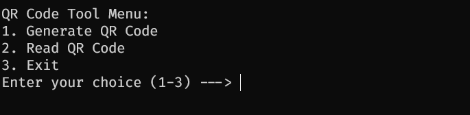

# qrcode_admin

## Description

This project contains multiple scripts that allow you to generate and read QR codes, and also to manage a database of QR codes.

**qrcode_admin.py** is the main script that allows you to generate and read QR codes.
**qrcode_val.py** is a script that initializes an API for validating QR codes.
**data_manager.py** is a script that allows you to manage the data in the database.

## Installation

### Requirements

- Python > 3.9

### Environment setup

1. Create and activate a virtual environment:

   **Linux/macOS:**

   ```bash
   python3 -m venv .venv
   source .venv/bin/activate
   ```

   **Windows:**

    ```bash
   python -m venv .venv
   .venv\Scripts\activate
   ```

2. Install dependencies:

   ```bash
   pip install -r requirements.txt
   ```

## Usage

To run the qr code admin script, run the following command:

```bash
cd bin
python qrcode_admin.py
```
In the main menu, you can choose between generating a QR code or reading one.



Example of a generated QR code:


To run the qr code validation script, run the following command:

```bash
python qrcode_val.py
```

## License

This project is licensed under the MIT License - see the [LICENSE](LICENSE) file for details.

## Author

[Neetre](https://github.com/Neetre)
